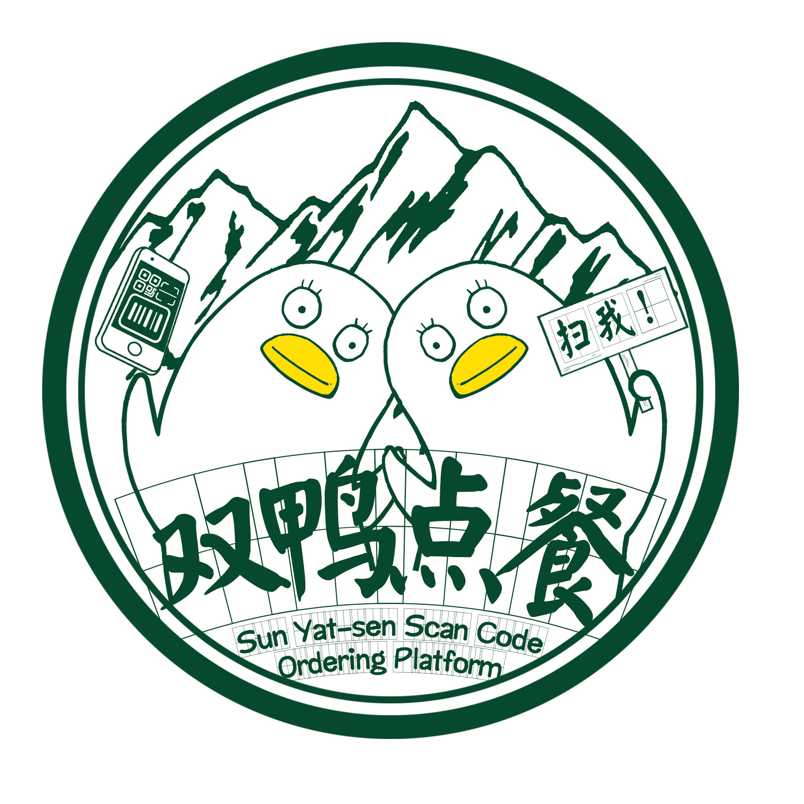

# Dashboard
Records of Sun Yat-sen Scan Code Ordering Platform（SYSSCOP）progress  
顾客端demo展示(gif，若暂时无法加载，可以试着刷新几次)：  
  
github pages:  
[Dashboard](https://gogogosysu.github.io/documents/)

## About Project
双鸭扫描点餐平台，为顾客提供一个无需登录，即扫即点，用户体验极佳的扫码点餐平台；为商家提供一个更个性化，智能的工具，有效地为餐厅节省人力成本，提高顾客点餐用餐效率，节省顾客时间，提高餐厅翻台率。  
双鸭扫码点餐平台分为客户端和商家端。客户仅需使用手机上的任意二维码扫描工具扫描餐厅的二维码，即可获得该餐厅以及菜谱信息，从而进行点餐。无需登录、无需关注微信号亦无需下载其他任何APP，同时，双鸭扫描点餐平台简化了使用流程，优化了界面设计，并有智能推荐功能且支持多人共点，专注做好扫码点餐平台。而商家端则有对应的安卓端APP，可以在APP上进行商家注册，填写商家的信息，制作电子菜谱。商家甚至可以自定义扫码页面的风格，使得双鸭扫码点餐平台的界面风格与店家装修风格相符。此外，商家端还会通过图表等信息，将本店的销售数据直观地展现给商家（并进行分析，进行估算），方便商家进行统计和规划，根据数据来改进餐厅，促进商家创造更高的收益。

## Team members

[team profile](./documents/team%20profile.md)

学号 | 姓名 | 班级
-|-|-
15331180|lianqy|上午班
15331158|LuyuanLi97|上午班
15331044|CZXHenry|下午班
15331157|Caroline1997|下午班
15331144|xiasilo|下午班
15331122|YitingKikyo|下午班

## Investigation
[调查问卷](https://www.wjx.cn/jq/21713433.aspx?t=636594121383241250)  
[前期调研报告](./documents/Investigation.md)  
[项目前期调研](./documents/Investigation.md)

## Version
随着外卖等服务的扩大，商家处于一个竞争愈演愈烈的圈子，为使得商家利益的不断扩大，扫码点餐服务开启了一个新的序幕。  
扫码点餐的兴起，使得商家节省了大量的人力物力，节省了大量的资金输出。  
为满足市场的需求，更好的服务市场，我们力求研发一款可以实现创新的稳定迅速而丰富的扫码点餐平台，力求打造双鸭超一流扫码点餐平台。

## Product Backlog
作为一个标准的扫码点餐平台，我们具备了扫码、点餐、结算、设置菜单、收取订单、后台分析数据反馈等基本功能。  
作为一个创新的扫码点餐平台，我们兼备了自动推荐菜单的人性化服务、商家改变菜单主题风格的美化服务。  
我们是收银+点餐+营销一体化系统，打造“零成本、高转化”的高效餐饮自运营体系。  
我们支持移动设备快速点菜下单、库存管理（菜单库存实时更新）、手机端随时查看门店经营数据、  
经营数据分析（销售排行、营业分析、退菜分析、客户分析）等让经营有的放矢、收银系统安装、菜单数据上传、员工使用说明。  

## Requirement specification
### Usecase Diagram
详见->[用例图](https://github.com/gogogoSYSU/documents/tree/master/Requirement%20specification/Usercase%20Diagram)
### Use Cases
详见->[用例+活动图](https://github.com/gogogoSYSU/documents/blob/master/Requirement%20specification/Use%20Cases/CustomerUsercaseText.md)
### Domain Model
详见->[领域模型](https://github.com/gogogoSYSU/documents/blob/master/Requirement%20specification/Domain%20Model/Costomer%20Domain%20Model.PNG)
### State Model
详见->[状态模型](https://github.com/gogogoSYSU/documents/blob/master/Requirement%20specification/State%20Model.PNG)
### System Sequence Diagram
详见->[功能模型](https://github.com/gogogoSYSU/documents/blob/master/Requirement%20specification/System%20Sequence%20Diagram/SSD.md)
### Supplementary Requirements
详见->[补充需求](https://github.com/gogogoSYSU/documents/blob/master/Requirement%20specification/Supplementary%20Requirements/SupplementaryRequirements.md)
## Design
### UI design
#### Our logo
 

#### Demo of customer（1.0）

使用手机扫码程序扫描以上二维码，点击直接查看，即可查看客户端UI的Demo。
目前完成简易版搜索、查看店家信息、查看菜品信息、结算等页面示意（2018/04/17）。

#### UI ofcustomer (2.0)
重构UI界面，添加折叠功能，可折叠单个菜品、隐藏类别导航栏、按列表折叠全部菜品,详情请见UI/UI2.0文件夹（2018/05/01）。

### Database design
#### 用户及权限系统数据库设计

#### 子系统数据库设计

#### 第三方数据评审结果
[第三方数据评审结果](./Requirement%20specification/Database%20Design/第三方数据评审结果.md)

### API设计
详见->[API 设计](https://github.com/gogogoSYSU/documents/blob/master/%E7%94%9F%E4%BA%A7%E8%A7%84%E8%8C%83%E4%B8%8E%E6%8C%87%E5%8D%97/RESTfulAPI%20%E8%AE%BE%E8%AE%A1%E8%A7%84%E8%8C%83.md)
API接口文档->[api](https://gogogosysu.docs.apiary.io/#)
### Software Architecture Document
详见->[Software Architecture Document](https://github.com/gogogoSYSU/documents/blob/master/Software%20Architecture%20Document/SoftwareArchitectureDocument.md)
### Usecase design
#### xx case design

## 生产规范与指南
### 代码规范
详见→[代码规范](./生产规范与指南)

### REST API设计规范
详见->[REST API 设计规范](https://github.com/gogogoSYSU/documents/blob/master/生产规范与指南/RESTfulAPI%20设计规范.md)

### 逻辑架构到应用程序映射指南

### 物理架构云上部署dock-compose.yml文件编写与使用
详见->[dock-compose](https://github.com/gogogoSYSU/documents/blob/master/%E7%94%9F%E4%BA%A7%E8%A7%84%E8%8C%83%E4%B8%8E%E6%8C%87%E5%8D%97/docker-compose.yml)

## Iterations

### Iteration 1

#### Week1(2018/03/18)

 - 需求分析：制定调查问卷、体验体验现有的扫码点餐平台
 - 设计：初步确定技术栈
 - 开发：学习Git的使用
 - 测试：无
 - 上线：无

#### Week2(2018/03/25)
 - [会议记录](./meetings/2018_03_25/2018_03_25.md)  
 - 需求分析：发放调查问卷，根据调查问卷的结果并结合实地使用经验，撰写项目前期调研报告。初步确定项目亮点
 - 设计：确定应用名称，确定应用logo，确定项目技术栈和基本框架
 - 开发：习惯Git的使用，明确基本分工，配置Android开发环境
 - 上线：无

#### Week3(2018/04/10)
 - [会议记录](./meetings/2018_04_10/2018_04_10.md)
 - 需求分析：完善需求规格说明，绘制Usecase diagram
 - 设计：绘制顾客端和商家端页面逻辑图，设计UI原型([顾客端](./UI/customerDemo/index.html)，手机版demo详见About UI模块的二维码)。
 - 开发：撰写技术学习报告或工具使用方法或项目工作经验总结：[汇总](./Reports/第一次report-链接.md)
 - 上线：无

#### Week4(2018/04/27)
 - [会议记录](./meetings/2018_04_27/2018_04_27.png)
 - 需求分析：无
 - 设计：设计UI2.0原型，制作E-R逻辑模型，完成[顾客端用例](Requirement%20specification/Use%20Cases/CustomerUsercaseText.md)，绘制顾客端领域模型，设计UI2.0，找两个第三方数据库评审人指出潜在问题
 - 开发：无
 - 上线：无
 - 学习：学习Vue.js以及基于Vue.js的Mint UI框架，学习go语言并成功搭建go环境，学习在云上部署服务器
 
 ### Iteration 2
 
 #### Week5（2018/05/15）
 - [会议记录](./meetings/2018_05_15/2018_05_15.png)
 - 需求分析：无
 - 设计：完成API设计
 - 开发：搭好环境之后开始代码的编写
 - 上线：无
 
 #### Week6（2018/06/02）
  - [会议记录](./meetings/2018_06_02/2018_06_02.png)
  - 需求分析：无
  - 设计：关于UI界面的一些功能进行了新的探讨
  - 开发：继续完成前后端的开发
  - 上线：无
  - 学习：探讨在开发中遇到的问题，进一步了解所使用的框架
  
  ### Iteration 3
  
  #### Week7（2018/06/19）
  - [会议记录](./meetings/2018_06_19/2018_06_19.png)
  - 需求分析：无
  - 设计：对商家端的开发进行探讨
  - 开发：将前端代码包装好为一个个组件，探讨数据交换问题，继续进行前后端的开发
  - 上线：无
  - 文档：组员分工完成所需的文档
  
  #### Week8（2018/06/25）
  - [会议记录](./meetings/2018_06_25/2018_06_25.png)
  - 需求分析：无
  - 设计：无
  - 开发：对数据进行修正，对界面适配进行修正，将后端挂上服务器，前后端进行对接并进行相应代码修正
  - 上线：完成应用的上线
  - 文档：组员分工完成所需的文档
 
 ## Tech/Work Report
 第一次学习报告链接[汇总](./Reports/第一次report-链接.md)
 
 ## Final Report
 
 ## 建模练习
 ### ofo共享单车应用
 [ofo共享单车应用](./建模练习/ofo共享单车应用.pdf)

 ### 建模要求
 详见ofo共享单车应用.pdf
 
 ### 建模者答案与评价
 我们邀请了两位同学完成我们的建模练习，详见[答案与评价](./建模练习/答案与评价.md)
